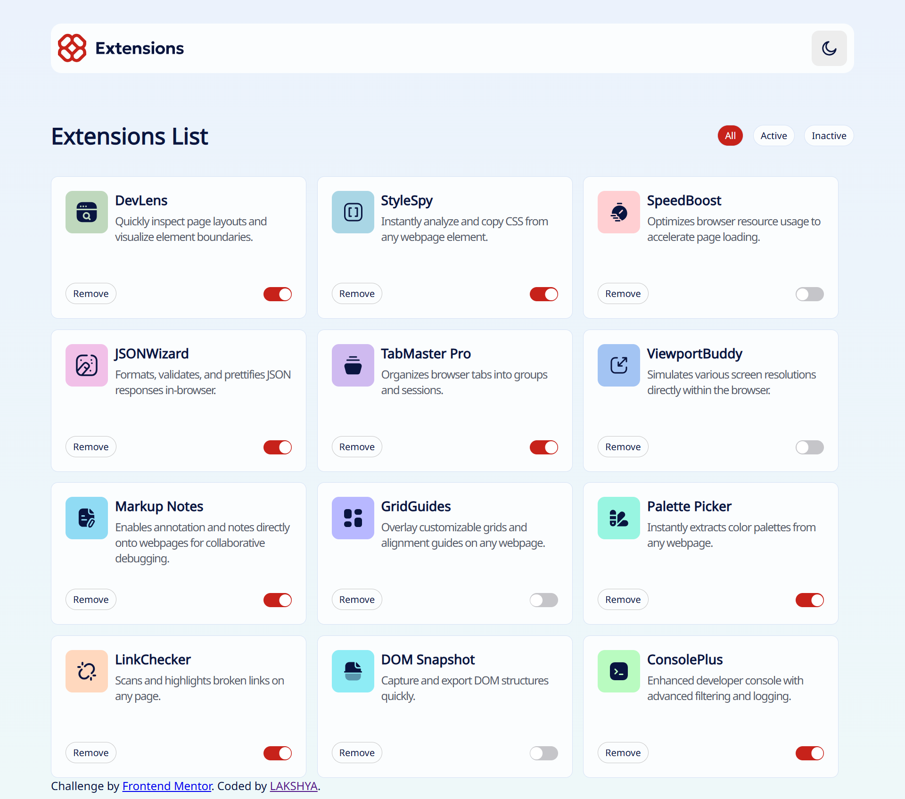
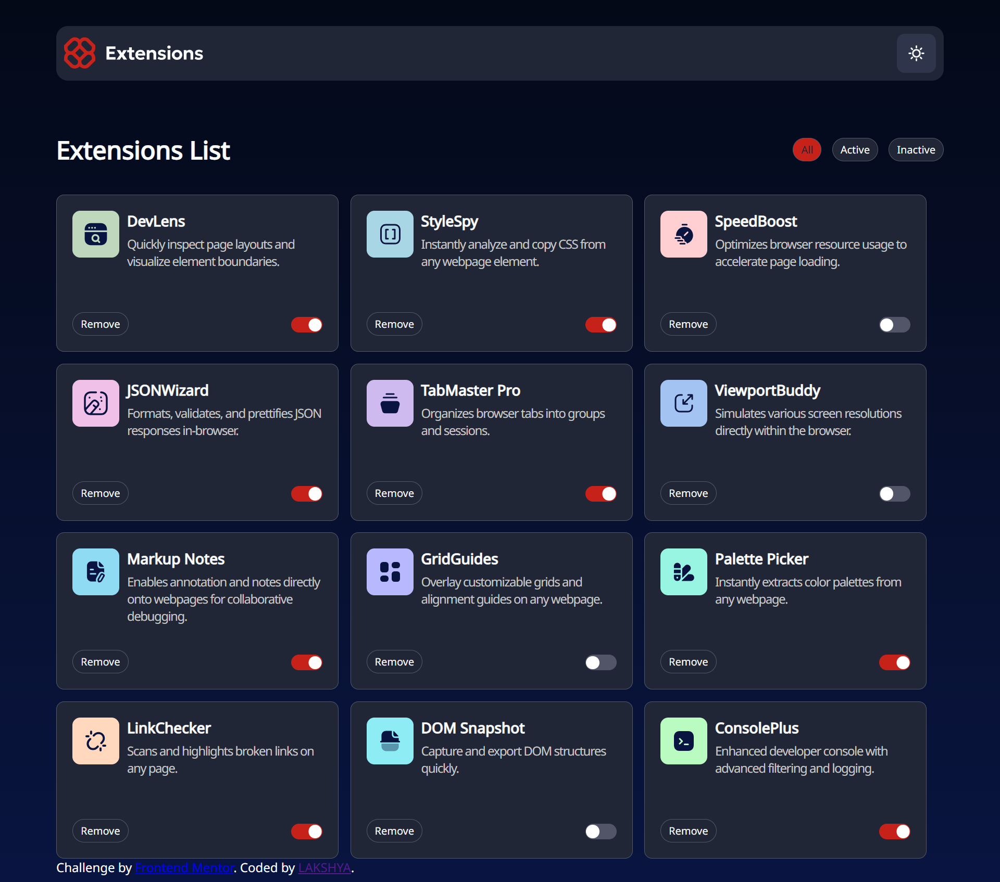
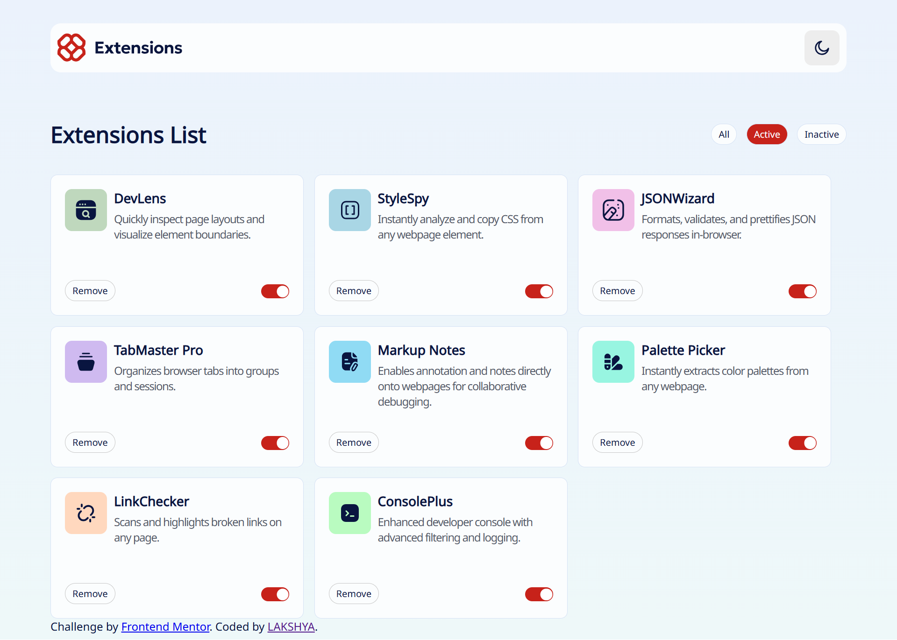
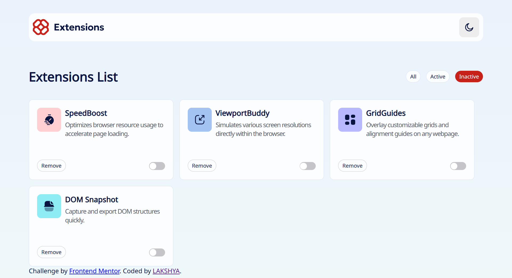
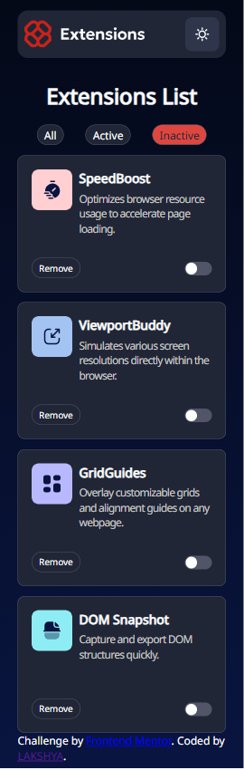
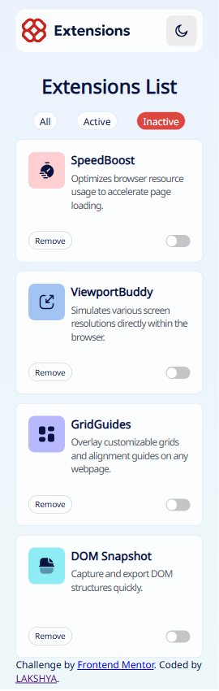

# Frontend Mentor - Browser extensions manager UI solution

This is a solution to the [Browser extensions manager UI challenge on Frontend Mentor](https://www.frontendmentor.io/challenges/browser-extension-manager-ui-yNZnOfsMAp). Frontend Mentor challenges help you improve your coding skills by building realistic projects. 

## Table of contents

- [Overview](#overview)
  - [The challenge](#the-challenge)
  - [Screenshot](#screenshot)
  - [Links](#links)
- [My process](#my-process)
  - [Built with](#built-with)
  - [What I learned](#what-i-learned)
  - [Continued development](#continued-development)
  - [Useful resources](#useful-resources)
- [Author](#author)
- [Acknowledgments](#acknowledgments)

## Overview

### The challenge

Users should be able to:

- Toggle extensions between active and inactive states
- Filter active and inactive extensions
- Remove extensions from the list
- Select their color theme
- View the optimal layout for the interface depending on their device's screen size
- See hover and focus states for all interactive elements on the page

### Screenshot
#### All Light

#### All Dark

#### Activity status


#### Mobile view




### Links

- Live Site URL: [Add live site URL here](https://your-live-site-url.com)

## My process

### Built with

- Semantic HTML5 markup
- CSS custom properties
- Flexbox
- CSS Grid

### What I learned
I learned about constructing the toggle button and adding styles to it.

```html
    <label class="switch">
        <input type="checkbox" class="toggleActive" >
        <span class="slider"></span>
    </label>
```
```css
    .switch {
    position: relative;
    display: inline-block;
    width: 40px;
    height: 22px;
    }
    .switch input {
    opacity: 0;
    width: 0;
    height: 0;
    }
    .slider {
    position: absolute;
    cursor: pointer;
    background-color: var(--sliderBg);
    border-radius: 22px;
    top: 2px;
    left: 0;
    right: 0;
    bottom: 0;
    /* transition: 0.4s; */
    }
    .slider::before {
    position: absolute;
    content: "";
    height: 17px;
    width: 17px;
    left: 1px;
    bottom: 1.5px;
    background-color: white;
    transition: 0.4s;
    border-radius: 50%;
    }
    input:checked + .slider {
    /* **Red 700**: `hsl(3, 77%, 44%)` */
    background: var(--Red-700);
    }
    input:checked + .slider::before {
    transform: translateX(21px);
    }
    .switch input:focus-visible + .slider{
    outline: 2px solid var(--Red-700) ;
    outline-offset: 2px;
    }
```

### Continued development

- Improve responsive-ness of website
- It should adapt for multiple devices not just mobile and desktop

## Author

- LinkedIn - [Lakshya Tyagi](https://www.linkedin.com/in/lakshya-tyagi-50341517b/)
- Frontend Mentor - [@lakshya142000](https://www.frontendmentor.io/profile/lakshya142000)


